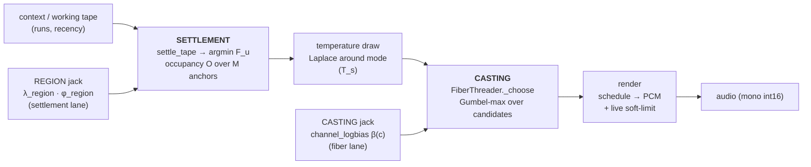
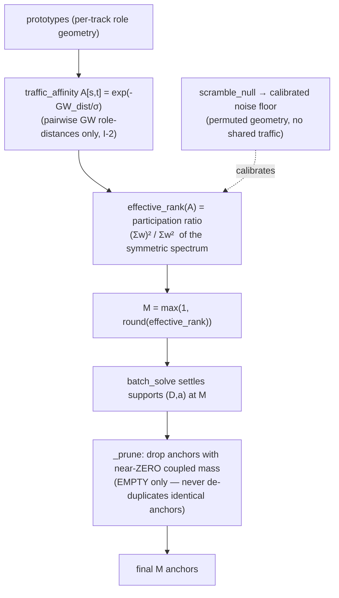
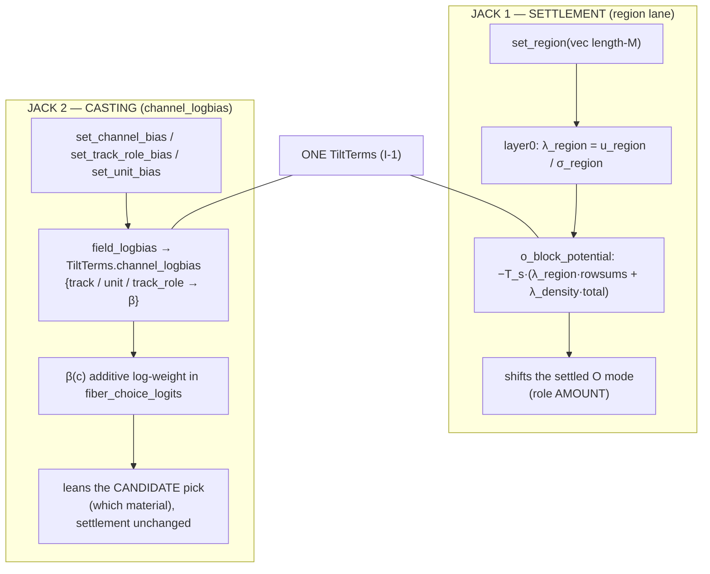
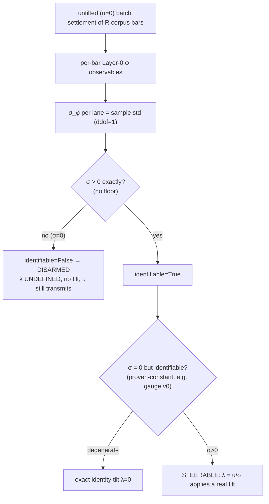

# ETS Steering Instrument — Technical Specification

**Status:** reference / as-built. **Date:** 2026-07-23. **Scope:** the steering
instrument as it stands now — the two-stage machine (SETTLEMENT + CASTING), the
bias mechanism (two jacks), the live Play grid, the read-side glow, and the
armed/disarmed measurement.

> **Verification discipline.** Every mechanism claim below carries a *Verified
> against* citation of `path:line` that was READ for this document. Where a fact
> could not be verified from code, or where the shipped code refines the framing
> in the task brief, it is called out explicitly as **UNVERIFIED** or **REFINES
> BRIEF**. Concrete numbers for `demo.etsworld` and `corpus20.etsworld` were
> obtained by loading the worlds and printing their `fstate` (see §2.4).
>
> **Runtime path note (load-bearing).** The runtime resolves `import ets` to
> `architecture-v6/ets` (the ui-v5 engine), forced to the front of `sys.path`
> at player construction (`cloud/companion/engine_bridge.py:512-521`). Therefore
> the authoritative writer/tilt code for the *casting jack* is
> `architecture-v6/ets/writer/tilt.py`, **not** the repo-root `ets/writer/tilt.py`
> — the two differ: root `tilt.py` has **no** `channel_logbias` carrier, arch-v6
> does. All casting-jack citations below point at arch-v6.

---

## Table of contents

1. [Mental model](#1-mental-model)
2. [Objects: units, tracks, roles, the fstate, and M](#2-objects-units-tracks-roles-the-fstate-and-m)
3. [The two stages: settlement and casting](#3-the-two-stages-settlement-and-casting)
4. [The bias mechanism and the two jacks (incl. the role wall)](#4-the-bias-mechanism-and-the-two-jacks)
5. [The grid: front-end, wire, routing](#5-the-grid-front-end-wire-routing)
6. [The read side: glow / telemetry (WEBFAB split)](#6-the-read-side-glow--telemetry)
7. [Armed / disarmed: a measurement, not a gear](#7-armed--disarmed-a-measurement-not-a-gear)
8. [Faithfulness invariants](#8-faithfulness-invariants)
9. [Deployment and capacity](#9-deployment-and-capacity)
10. [File map (path → role)](#10-file-map)
11. [Open questions / UNVERIFIED](#11-open-questions--unverified)

---

## 1. Mental model

The instrument is a **two-stage generative machine** wrapped by a **thin browser
client**. A frozen "world" (an `.etsworld`) carries `M` emergent anchors (roles)
with a spectral color profile each. Each bar:

1. **SETTLEMENT** decides *how much of each role* the bar holds — an occupancy
   matrix `O : (M, S_out)` found by Lyapunov-certified descent of the single
   functional `F` (a Gibbs/O-block equilibrium), optionally tilted by the
   **region jack**.
2. **CASTING** fills each already-role-stamped slot by *choosing among candidate
   source units* (which differ by TRACK / unit) via a temperature sampler over
   the Layer-0 fiber measure, optionally leaned by the **casting jack**
   (`channel_logbias`).



*Verified against:* pipeline order in `architecture-v6/ets/writer/stream.py:152-189`
(`write_bar`: settle → sample → fiber); settlement in
`architecture-v6/ets/writer/settle.py:89-178`; casting in
`architecture-v6/ets/writer/realize.py:262-356`; render/limit in
`cloud/companion/engine_bridge.py:1385-1416`.

The two stages steer **orthogonal quantities**: settlement steers *role AMOUNT*
(occupancy), casting steers *which material realizes a role* (track/unit choice).
This split is why role amount cannot ride the casting jack (the **role wall**, §4.3).

---

## 2. Objects: units, tracks, roles, the fstate, and M

### 2.1 The three-level typing

```
   BAR  ──settled by──▶  ROLES (anchors, k=0..M-1)      [EMERGENT]
                            │  amount decided at SETTLEMENT
                            ▼
   each active (slot,band) picks a  ROLE k = argmax(col · B[:,b])
                            │
                            ▼
   fiber choice set = candidate UNITS of role k in band b        [choice]
     each candidate has a  TRACK (source track_id)   [GIVEN — input source]
     and is a  UNIT (beat-normalized sound unit)     [GIVEN — input source]
                            │  which unit fills the slot decided at CASTING
                            ▼
   placed row (out_slot, src_track, src_unit, section, mass)
```

| Level | Origin | Decided at | Verified against |
|---|---|---|---|
| **unit** | GIVEN (input source unit; provenance) | casting (which unit) | `architecture-v6/ets/writer/realize.py:273-297` (candidate units), `:329-354` (placement rows) |
| **track** | GIVEN (source track_id) | casting (rides candidate) | `cloud/companion/channel_bias.py:67-71` (`channel_tids`) |
| **role** | **EMERGENT** anchor (not given; self-sized from cross-track traffic) | settlement (amount) | `architecture-v6/ets/functional/anchors.py:1-24, 148-188` |

Roles are emergent: anchors are the self-sized cross-track-traffic modes, not
labels supplied by the corpus. `build_index` materializes "what role k sounds
like in band b" from the frozen world by settling each track's coupling into the
frozen anchors — a read, granting the tape zero structural authority
(`architecture-v6/ets/writer/realize.py:91-187`).

### 2.2 The fstate fields

The frozen world's `fstate` (`FState`) carries, per anchor:

| Field | Shape | Meaning | Verified against |
|---|---|---|---|
| `B` | (M, n_bands) | band profile = spectral "color" per anchor (simplex rows, frozen) | `architecture-v6/ets/functional/anchors.py:129-145` (`coupling_weighted_B`), `:174-175` |
| `D` | (M, M) | inter-anchor coupling (symmetric, zero diagonal) | `architecture-v6/ets/functional/anchors.py:103` |
| `a` | (M,) | anchor mass | `architecture-v6/ets/functional/anchors.py:104, 123` |
| `theta` | (M, S) | anchor slot/phase profile | `architecture-v6/ets/functional/anchors.py:106` |
| `pis` | list of (K_t, M) | per-track couplings to anchors | `architecture-v6/ets/functional/anchors.py:107` |
| `phase_off`, `transpose` | (n_tracks,) | per-track gauge offsets | `architecture-v6/ets/functional/anchors.py:108-109` |

`B` is a **freeze-time readout** of the settled couplings, deliberately NOT the
F-argmin in the B direction (F is band-blind at the uniform fixed point); it
stays FROZEN post-training. *Verified against:*
`architecture-v6/ets/functional/anchors.py:154-164, 174-175`.

### 2.3 M derivation (a COUNT, not a guarantee of distinct roles)



- `M = max(1, int(round(effective_rank(traffic_affinity))))` — *Verified against:*
  `architecture-v6/ets/functional/anchors.py:170` (inside `build_world`, `:148-188`).
- `effective_rank` = participation ratio `(Σw)²/Σw²` of the non-negative symmetric
  spectrum — *Verified against:* `architecture-v6/ets/functional/anchors.py:51-59`.
- `traffic_affinity` built from GW role-distances only (no coordinate crosses a
  track boundary) — `architecture-v6/ets/functional/anchors.py:36-48`.
- `scramble_null` = the calibrated noise reference (independently permute each
  track's geometry so no shared traffic survives) — `:77-87`.
- `_prune` drops anchors whose **coupled mass** is below the mass floor
  (`keep = m >= 0.01 * Σm`), i.e. EMPTY anchors; it does **not** de-duplicate
  identical anchors — `architecture-v6/ets/functional/anchors.py:114-126`.

**Consequence (load-bearing):** M is the *rank of the cross-track coupling* — a
count. Two anchors can be identical (a mirror pair) and both survive, because
prune only removes empty mass, never duplicates. The demo is exactly this case.

### 2.4 Concrete example: demo (M=2, mirror pair) vs corpus20 (M=5, distinct)

Loaded live from the world files (see verification note at top):

**`demo.etsworld` — M=2, degenerate/mirror pair.** Both `B` rows identical, `theta`
identical, `a` equal, only `D` couples them off-diagonally:

```
B (2 × 8), both rows identical, flat 1/8 = 0.125:
  [0.125 0.125 0.125 0.125 0.125 0.125 0.125 0.125]
  [0.125 0.125 0.125 0.125 0.125 0.125 0.125 0.125]
a     = [2.002, 2.002]         (equal masses)
theta rows identical: True
D     = [[0.0000, 2.6226],
         [2.6226, 0.0000]]     (symmetric off-diagonal only)
```

**`corpus20.etsworld` — M=5, distinct roles.** `B` rows differ (real band spread):

```
B (5 × 8), DISTINCT rows:
  [0.0916 0.2787 0.3574 0.1502 0.0860 0.0358 0.0003 0.0000]
  [0.0220 0.5152 0.2285 0.1154 0.0553 0.0275 0.0348 0.0011]
  [0.2378 0.0603 0.1448 0.2287 0.1568 0.0979 0.0718 0.0019]
  [0.5780 0.1210 0.0000 0.0565 0.0794 0.0832 0.0802 0.0018]
  [0.2175 0.1911 0.0281 0.0900 0.1695 0.1591 0.1401 0.0047]
a     = [0.2, 0.2, 0.2, 0.2, 0.2]
```

The demo's flat/identical `B` is the **band-blind fixed point** (uniform B), which
is what disarms the profile-routed field controls on the demo (§7).

*Verified against:* live load of `fstate` via
`architecture-v6/ets/engine/worldfile.py:load_world`; the uniform-B semantics are
documented at `cloud/companion/engine_bridge.py:38-60`.

---

## 3. The two stages: settlement and casting

### 3.1 SETTLEMENT (the Gibbs equilibrium / O-block)

`settle_tape` runs a block-coordinate entropic-mirror (KL) I-projection on the
tape's one free block `O : (M, S_out)`, in the field of the frozen anchors, to a
Lyapunov F-descent certificate. The tilted objective is the Doob-conditioned mode:

```
F_u(O) = F_O(O)  −  T_s · Σ_i λ_i φ_i(O)
```

Exactly **two** of the five φ factor through the O-block: `φ_region` (per-anchor
row sums) and `φ_density` (total mass), both linear in O. Their potential and
gradient come from `tilt.o_block_potential` / `tilt.o_block_gradient` — one home
for the tilt math.

| Item | Verified against |
|---|---|
| block-coordinate mirror-descent, Lyapunov accept guard | `architecture-v6/ets/writer/settle.py:89-178` (loop `:151-171`) |
| O-block tilt potential (region row-sums + density total) | `architecture-v6/ets/writer/tilt.py:217-226` |
| O-block gradient (constant; both φ linear) | `architecture-v6/ets/writer/tilt.py:229-233` |
| untilted short-circuit (`tilt is None or is_untilted` ⇒ g_tilt=0.0, bit-identical) | `architecture-v6/ets/writer/settle.py:121-133` |

The certificate is required: a bar whose settlement fails `converged and
monotone` raises `StreamHalt` — no uncertified bar is emitted
(`architecture-v6/ets/writer/stream.py:169-173`).

### 3.2 CASTING (temperature sampler + fiber pick)

Two sub-steps after settlement:

**(a) Temperature draw.** A Laplace draw around the settled mode `O*`, per free
column, variance scaled by `T_s` along the local Hessian eigendirections. This
scales *looseness*, never the mode. `T_s ≤ 0` or a clamped column ⇒ no draw for
that column. *Verified against:* `architecture-v6/ets/writer/stream.py:114-150`
(`_sample_temperature`); the rng `z` is drawn unconditionally to keep alignment
stable (`:135-137`).

**(b) Fiber pick.** For each active `(slot, band)` the role `k = argmax(col·B[:,b])`
is fixed by the (already-settled) O; the choice set is
`{ continue the band's source run } ∪ { seed candidates: real units of role k in
band b }`. Each candidate is scored by F's own fiber energies plus the Layer-0
tilt terms, and one is drawn by Gumbel-max (exact categorical, deterministic given
the seed):

```
log w(c) = −E_F(c)/T_s + λ_cont·1[cont](c) + λ_novelty·reuse(c) + β(c)
```

where `β(c)` is the **casting-jack** addend (§4.2). *Verified against:*
`architecture-v6/ets/writer/realize.py:262-321` (`_choose`, energies at `:280-284`,
logits at `:313-314`, Gumbel-max at `:316-320`); `place_slot`
`architecture-v6/ets/writer/realize.py:323-356`; the logit formula in
`fiber_choice_logits` `architecture-v6/ets/writer/tilt.py:349-378`.

```
                    settled O column (M,)               fiber energies (F's own T1p/T4)
                          │                                        │
   role k = argmax(col·B[:,b]) ──▶  choice set { run-cont } ∪ { role-k units } ──▶
        (SETTLEMENT decided k)             (CASTING decides WHICH candidate)
                                                   │
                       logits = −E/T_s + λ_cont·cont + λ_novelty·reuse + β(c)
                                                   │
                                    j = argmax(logits + Gumbel)   ──▶  (track,unit) placed
```

---

## 4. The bias mechanism and the two jacks

There are exactly **two steering jacks**, one per stage. Both ride the SINGLE
`TiltTerms` object the writer consumes (invariant I-1). Neither adds a second
control channel.



### 4.1 Settlement jack — the region lane

- `set_region(region)` stores a length-M vector, clamped to the engine's own safe
  envelope (`clamp_region`) — `cloud/companion/engine_bridge.py:1164-1175`.
- It becomes `λ_region = u_region / σ_region` in `layer0` (natural units: standard
  fluctuations of lean) — `architecture-v6/ets/writer/tilt.py:146-209`.
- It enters settlement as the O-block region row-sum potential — `:217-226`.
- **REGION_SCALE** = `ets.panel.envelope.SAFE_REGION_MAGNITUDE = 1.0`
  (`architecture-v6/ets/panel/envelope.py:41`; clamp at `:55`). The FE mirrors this
  constant as its column-bias scale (`cloud/companion/engine_bridge.py:1024-1041`).

### 4.2 Casting jack — `channel_logbias` on the single carrier

The casting jack is a soft, additive log-weight `β(c)` on the fiber candidate
logits — a bias the settlement works AROUND, never a clamp. Three grains, resolved
**additively** per candidate:

```
β(c) = β_track[c.track_id] + β_unit[c.unit_id] + β_track_role[(c.track_id, k)]
```

| Grain | Setter | Builder | Key | Verified against |
|---|---|---|---|---|
| **track** (roll-up) | `set_channel_bias(vec)` | `channel_logbias` | `track_id` | `cloud/companion/engine_bridge.py:1248-1280`; `cloud/companion/channel_bias.py:81-105` |
| **(track,role)** sub-track | `set_track_role_bias(map)` | `track_role_logbias` | `(track_id, role_k)` | `cloud/companion/engine_bridge.py:1314-1343`; `cloud/companion/channel_bias.py:172-192` |
| **unit** (dormant on the grid) | `set_unit_bias(map)` | `grain_logbias` | `unit_id` | `cloud/companion/engine_bridge.py:1282-1312`; `cloud/companion/channel_bias.py:108-129` |

- All three grains are assembled into ONE tagged datum by `field_logbias(track,
  unit, track_role)` and folded onto the single `TiltTerms.channel_logbias` at the
  one construction point `engine._tilt_for(u, a=, channel_logbias=)` —
  `cloud/companion/engine_bridge.py:1406-1412`; `architecture-v6/ets/engine/engine.py:456-479`.
- Per-candidate resolution (the `β_track + β_unit + β_track_role` sum) happens in
  `FiberThreader._choose` — `architecture-v6/ets/writer/realize.py:303-314`.
- Strength scale is **derived, not hand-set**: `β = strength · amplify` with
  `strength = LAMBDA['T1p']` read live (F's own metrical phase-charge weight) —
  `cloud/companion/channel_bias.py:74-78`.
- Amplify ∈ [-1, 1] is **bidirectional** (positive up-weights, negative soft-damps;
  damp is soft, never a hard mute) — `cloud/companion/channel_bias.py:14-32`.
- `channel_logbias` (and `a`) are **excluded from `is_untilted`**, so F / the O-block
  solve / settlement / render are byte-identical when only these are set —
  `architecture-v6/ets/writer/tilt.py:213-219`.

### 4.3 Why role AMOUNT cannot ride the casting jack (the role wall)

Within one fiber choice set every candidate shares the same settled role `k` (the
set is exactly "role-k units in band b"), and `k` is chosen by the O-block, which
the fiber never revisits. A **pure-role** addend is therefore a softmax constant
over the choice set — it cancels in the Gumbel-argmax and leaves the draw
byte-identical even at nonzero bias (inert). So:

- **role AMOUNT** is steered at **settlement only** (the region lane; `φ_region` is
  per-anchor = per-role, an O-block tilt).
- **(track, role)** *does* steer, because it varies across the set via the **track**
  key even though `k` is fixed — this is how the cell grain dodges the wall.

*Verified against:* `cloud/companion/channel_bias.py:49-59` (role-wall derivation);
grain selection `FIELD_GRAINS = ("track","unit","track_role")` at
`architecture-v6/ets/writer/tilt.py:106-124`; the `(c.track_id, k)` lookup at
`architecture-v6/ets/writer/realize.py:310-312`.

---

## 5. The grid: front-end, wire, routing

The live Play surface is a **track × role grid** (`FIELD_GRID_ENABLED = true`,
`cloud/companion/static/index.html:1742`). All lanes coexist; neutral is
byte-identical; columns honest-disarm.

```
              role R0     role R1     role R2   ... (COLUMNS → SETTLEMENT / region jack)
          ┌───────────┬───────────┬───────────┐
 track 0  │  cell     │  cell     │  cell     │   ROWS → CASTING (track roll-up, channel_bias)
          ├───────────┼───────────┼───────────┤
 track 1  │  cell     │  cell     │  cell     │   CELLS (track,role) → CASTING (track_role_bias)
          ├───────────┼───────────┼───────────┤
 track 2  │  cell     │  cell     │  cell     │
          └───────────┴───────────┴───────────┘
   ▲ row header = TRACK roll-up (channel_bias)      ▲ column header = ROLE (region_add → region)
```

| Grid element | Steers | Wire field | Bridge setter |
|---|---|---|---|
| row (track header) | casting (track roll-up) | `channel_bias` (vector) | `set_channel_bias` |
| cell (track,role) | casting (sub-track) | `track_role_bias = [[t,k,amp],…]` | `set_track_role_bias` |
| column (role header) | settlement | folded into `payload.region` (`region_add`) | `set_region` |

- Wire assembly (payload): `cloud/companion/static/index.html:1701-1709` —
  `channel_bias`, `track_role_bias`, and `region_add` folded into `payload.region`.
- Routing at `/api/steer`: `cloud/companion/app.py:1404-1462` — `set_region`
  (`:1417`), `set_channel_bias` (`:1435`), `set_unit_bias` (`:1445`),
  `set_track_role_bias` from the JSON-safe `[[t,k,amp]]` list (`:1452-1461`).
- A disarmed/degenerate lane is simply **absent** from the payload (FE emits no
  force) — honesty enforced on both sides (`cloud/companion/app.py:1396-1403`).

**Byte-identical neutral:** a neutral grid sends all-zero `channel_bias` /
`track_role_bias` and zero `region_add`; each clears to `None` in its setter ⇒ no
addend / no tilt ⇒ byte-identical audio (`cloud/companion/engine_bridge.py:1275-1280,
1326-1329`; `architecture-v6/ets/writer/tilt.py:213-219`).

---

## 6. The read side: glow / telemetry

The glow (read side) is strictly **separate** from the bias ring (write side) — a
WEBFAB split. All glow reductions read the *produced rows* / *committed O* only,
call nothing downstream (no settlement / writer / render / F), so audio is
byte-identical whether or not they run.

| Glow | Source | Read-only reduction | Verified against |
|---|---|---|---|
| row glow (per-track) | `nowplaying` | mass by `src_track` | `cloud/companion/engine_bridge.py:1435-1436` (`nowplaying_activity`) |
| cell glow (per track,role) | `nowplaying_track_role` | reconstructed read-only from committed O, mass-conserving | `cloud/companion/engine_bridge.py:114-160` (`track_role_activity`), `:1454-1472` |
| column glow (per role) | sum over tracks | `fieldColShares`: Σ_tracks `nowplaying_track_role[*,k]` | `cloud/companion/static/index.html:1976-1987` |
| unit glow (dormant) | `nowplaying_unit` | mass by `src_unit`, peak-normalized, EMA-smoothed | `cloud/companion/engine_bridge.py:91-111, 1444-1453` |

Display-only EMA smoothing (`_NP_UNIT_ALPHA = 0.45`) fades a just-played unit
across a few bars instead of strobing; it smooths REAL placement telemetry and
never touches audio (`cloud/companion/engine_bridge.py:62-70`).

**Tape-write is blind to the bias.** The committed tape records *placed units*
(`out_slot, src_track, src_unit, section, mass`), not β. The bias is a READ-time
weight on the fiber draw — it leaves only a transient wake in the ephemeral
play-tape (run heads / recency), never a written β in the frozen corpus.
*Verified against:* placement row shape `architecture-v6/ets/writer/realize.py:329-354`;
fiber state (run heads, last-used) is bounded working tape only,
`architecture-v6/ets/writer/realize.py:224-260`.

---

## 7. Armed / disarmed: a measurement, not a gear

"Armed" is a **mirror**, not a steering part: a lane offers steering only if the
physics genuinely fluctuates there. It is derived from MEASURED per-corpus σ_φ of
the **untilted** settlement — "no invented floor".



- σ_φ measured by untilted settlement, sample std ddof=1, **identifiable := σ>0
  exactly, no floor** — `cloud/companion/train_local.py:91-148` (region collapses
  all-or-nothing at `:130-134`).
- The engine backstop: `_lam` returns 0 when `not identifiable` (DISARMED, records
  the lane) and 0 when `σ==0` (degenerate identity tilt) —
  `architecture-v6/ets/writer/tilt.py:146-160`.
- `region_armed` = `"region" in armed` = whether the settlement genuinely
  fluctuates along the region lane — `cloud/companion/engine_bridge.py:1005-1023,
  1040`. The FE greys column headers when `!world.regionArmed`
  (`cloud/companion/static/index.html:1967-1970`).
- Anchor-profile arming: `anchor_profile_armed(B)` returns True iff B distinguishes
  bands above a relative-spread floor (`_PROFILE_ARMING_EPS = 1e-6`); a uniform
  (band-blind) B returns False, disarming the role→unit drill and the track-square
  lean while keeping the track→role drill and role bias live —
  `cloud/companion/engine_bridge.py:73-88, 632-638`.

**Measured arming (this document, live):**

| World | M | profile_armed | region σ_φ (per anchor) | region | density | cont | novelty | gauge |
|---|---|---|---|---|---|---|---|---|
| `demo.etsworld` | 2 | **False** (uniform B) | [0.637, 0.500] | **armed** | armed | armed | armed | **degenerate** (σ=0) |
| `corpus20.etsworld` | 5 | **True** (distinct B) | [0.030, 0.010, 0.034, 0.020, 0.029] | **armed** | **DISARMED** | armed | novelty armed | **DISARMED** |

> **REFINES BRIEF.** On the **demo**, the region lane is genuinely **ARMED**
> (σ_φ.region = [0.637, 0.500] > 0), even though the world is a B-degenerate/mirror
> pair. The demo's degeneracy is in **B** (`profile_armed=False`, so the unit drill
> and track-square lean disarm) and in **gauge** (σ_gauge = 0.0 → degenerate
> identity tilt, the frozen-frame v0 wall). So "region honestly disarms on a
> degenerate corpus" is a *general capability of the mechanism*, but it is **not**
> exercised by the demo — neither demo nor corpus20 disarms region. Gauge is
> `identifiable=True` yet `σ=0`, i.e. the **degenerate** class (exact identity),
> distinct from the **disarmed** class (`identifiable=False`) that corpus20's
> density/gauge fall into. *Verified against:* live load + `resolve_sigma`; the
> degenerate-vs-disarmed distinction is computed in
> `cloud/companion/engine_bridge.py:1012-1023`.

---

## 8. Faithfulness invariants

| Invariant | What it guarantees | Verified against |
|---|---|---|
| **Byte-identical when neutral** | `is_untilted` excludes `channel_logbias`/`a`; settlement short-circuits ⇒ F/settle/render bit-identical at u=0 + no bias | `architecture-v6/ets/writer/tilt.py:213-219`; `architecture-v6/ets/writer/settle.py:121-133` |
| **Single carrier (I-1)** | all control reaches the writer only as one `TiltTerms`, produced only by `layer0` | `architecture-v6/ets/writer/settle.py:100-104` (TypeError otherwise); `architecture-v6/ets/engine/engine.py:456-479` |
| **No root-engine edit for the bias family** | bias lives in the cloud layer (`channel_bias.py`) + arch-v6 writer; the tilt carrier extends `TiltTerms` additively | `cloud/companion/channel_bias.py`; `architecture-v6/ets/writer/tilt.py:97-219` |
| **Glow read-only** | all telemetry reduces produced rows / committed O; no downstream call | `cloud/companion/engine_bridge.py:91-160` |
| **Tape write blind to bias** | recorded rows are placed units, not β; bias is a read-time fiber weight | `architecture-v6/ets/writer/realize.py:329-354` |
| **σ_φ measured, not fabricated** | untilted settlement, `σ>0` exactly, no floor | `cloud/companion/train_local.py:91-148` |
| **Honest disarm** | disarmed lane applies no tilt but still transmits u; never invents λ | `architecture-v6/ets/writer/tilt.py:146-160` |
| **Privacy boundary (CS-1..CS-5)** | only stage-3 crosses the wire (whitelist-encoded); no cloud decoder | `cloud/companion/app.py:22-28, 147, 249` |

Product invariants R1–R6 (device-origin audio; cloud training; audio-flow; reset;
fresh-clone-plays; cloud-served interface [target]) are recorded in
`cloud/COMPANION_INVARIANTS.md`.

---

## 9. Deployment and capacity

```mermaid
flowchart LR
  subgraph BROWSER["Browser (THIN client)"]
    UI["Play grid + XY pad<br/>index.html"] -- "POST /api/steer" --> SRV
    UI -- "GET /api/stream (PCM)" --> SRV
    FILE["device audio (drag-drop)"] -- "POST /api/train" --> SRV
  end
  subgraph SRV["ets-web SERVER (compute)"]
    STEER["/api/steer → bridge setters"] --> PLAYER["StreamPlayer<br/>settlement + casting + render"]
    PLAYER -- "PCM bars" --> BROWSER
    TRAIN["/api/train → build_trained_world"] --> FIT["in-proc cloud anchor-fit<br/>cloud_url = 'inproc'"]
    FIT --> WORLD[".etsworld (frozen)"]
  end
```

- The browser is a **thin client**: it streams audio and POSTs steer; all
  settlement + casting + render run on the server (`StreamPlayer`,
  `cloud/companion/engine_bridge.py:495-533`; produce loop `:1385-1483, 1573+`).
- Cloud anchor-fit runs **in-proc** (`cloud_url="inproc"` default) —
  `cloud/companion/train_local.py:228-231, 257-258`.
- Train path is **lazy-bank**: `build_trained_world` walks ingest → stage3 →
  cloud_fit → verify → build → sigma_phi → save; it does **not** build the sample
  bank. The bank is materialized on first playback (`_ensure_bank` →
  `build_bank`) — `cloud/companion/train_local.py:228-275`;
  `cloud/companion/engine_bridge.py:1380-1383`.
- Capacity (MEASURED, deployed path, 20 tracks · 30 min · float16):
  **Train peak ≈ 1351 MB (~1.35 GB)**, **Playback ≈ 2271 MB (~2.27 GB)** —
  `papers/CAPACITY_STUDY.md:123-126` (§2 correction, 2026-07-20).
- Privacy: only stage-3 crosses the wire (whitelist-encoded cost/mass/slot_hist/
  band_profile), no cloud decoder — `cloud/companion/app.py:22-28`.

---

## 10. File map

| Path | Role in the instrument |
|---|---|
| `architecture-v6/ets/functional/anchors.py` | M derivation (traffic affinity, effective_rank, prune) + world build/settle |
| `architecture-v6/ets/functional/f.py`, `solver.py` | the single functional F, `_dF_dO`, batch solve |
| `architecture-v6/ets/writer/settle.py` | SETTLEMENT: `settle_tape` (O-block Lyapunov descent, tilted) |
| `architecture-v6/ets/writer/stream.py` | live writer: `write_bar`, `_sample_temperature` (temperature draw) |
| `architecture-v6/ets/writer/realize.py` | CASTING: `FiberThreader._choose`/`place_slot`, `build_index`, β resolution |
| `architecture-v6/ets/writer/tilt.py` | `TiltTerms` (single carrier), `layer0`, `fiber_choice_logits`, o-block potential/gradient, `is_untilted` |
| `architecture-v6/ets/engine/engine.py` | `_tilt_for` (single tilt-construction point), bank build, live loop |
| `architecture-v6/ets/panel/envelope.py` | `SAFE_REGION_MAGNITUDE = 1.0`, `clamp_region` |
| `cloud/companion/engine_bridge.py` | `StreamPlayer`: setters, produce loop, glow reductions, arming, eigenpanel |
| `cloud/companion/channel_bias.py` | casting-jack builders (`channel_logbias`, `grain_logbias`, `track_role_logbias`, `field_logbias`), role-wall note, derived strength |
| `cloud/companion/train_local.py` | train seam (`build_trained_world`), per-corpus σ_φ calibration |
| `cloud/companion/app.py` | HTTP surface: `/api/steer` routing, `/api/train`, CS boundary |
| `cloud/companion/static/index.html` | Play grid FE (`FIELD_GRID_ENABLED`, payload assembly, `fieldColShares`, disarm) |
| `cloud/COMPANION_INVARIANTS.md` | product invariants R1–R6 |
| `demo.etsworld` | committed self-contained demo world (M=2, mirror pair) |
| `papers/CAPACITY_STUDY.md` | measured train/playback memory ceilings |

---

## 11. Open questions / UNVERIFIED

- **Root vs arch-v6 `tilt.py`.** Casting-jack citations point at
  `architecture-v6/ets/writer/tilt.py` because that is what the runtime imports
  (`engine_bridge.py:512-521`). The repo-root `ets/writer/tilt.py` has **no**
  `channel_logbias` (verified by diff). The task brief cited root `ets/writer/tilt.py`
  for `fiber_choice_logits` / `_sample_temperature`; the authoritative, shipped
  copies are the arch-v6 ones. Root is byte-identical to arch-v6 *minus* the
  live-only cap **and** minus the bias-carrier extension — the second half of that
  is a **REFINES BRIEF** correction.
- **`_sample_temperature` naming.** The brief lists `_sample_temperature` under
  `ets/writer/tilt.py`; it actually lives in
  `architecture-v6/ets/writer/stream.py:114-150` (a `StreamWriter` method), not in
  `tilt.py`. Verified.
- **Demo region arming.** See the §7 REFINES-BRIEF box: the demo's region lane is
  armed, not disarmed; only its B (profile) and gauge lanes are degenerate.
- **Eigenpanel / modes-by-temperature.** The `StreamPlayer` also computes a native
  control eigenbasis (`compute_eigenmodes`, `engine_bridge.py:375-492`) and an
  optional modes-by-temperature sweep. These are a *read-only display/pad-basis*
  layer over the same two jacks, not a third steering stage; they are documented
  here only in passing and were **not** exhaustively verified for this spec.
- **`FStateM` accessor.** `world.M` / `world.fstate.a.shape[0]` are used
  interchangeably as the anchor count; both were observed equal on the two worlds
  loaded, but the invariant `world.M == fstate.a.shape[0]` was not independently
  proven from code — treated as **assumed**.
- **`a` (anisotropy) and `wobble`.** The second-moment shape lane
  (`set_wobble` → `TiltTerms.a`) is part of the carrier but is not surfaced on the
  current grid; its FE exposure was not verified.
